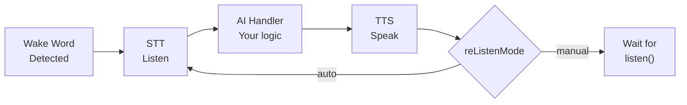

<p align="center">
  
</p>

# react-native-voice-activator

On-device wake word detection and managed multi-turn voice conversation sessions for React Native and Expo. Say a trigger phrase — the package handles listening, transcription, and speech output, you decide what happens with the transcript in between.

No cloud required for wake word detection. Speech-to-text and text-to-speech run on-device through opt-in providers.

> **Supports:** React Native `0.86+` · Expo SDK `57+` · iOS · Android
> **Expo Go is NOT supported.** Use `expo prebuild` or EAS Build.

📖 **[Full documentation site](https://prompt-agency.github.io/react-native-voice-activator/)**

## Table of Contents

- [What It Does](#what-it-does)
- [Requirements](#requirements)
- [Installation](#installation)
- [Quickstart](#quickstart)
- [Conversation Session](#conversation-session)
- [Built-In Wake Words](#built-in-wake-words)
- [Optional: Speech-to-Text](#optional-speech-to-text)
- [Optional: Text-to-Speech](#optional-text-to-speech)
- [Troubleshooting](#troubleshooting)
- [Privacy & Compliance](#privacy--compliance)
- [Documentation](#documentation)

---

## What It Does



- **Wake word detection** — on-device, no cloud, no API key. real engine-backed local wake word detection is implemented through the built-in native-managed engine path (Sherpa-ONNX with bundled models).
- **Managed conversation sessions** — the package drives the full wake → listen → AI → speak → re-listen loop.
- **Barge-in** — say the wake word while the AI is speaking to interrupt and start a new turn immediately (~300ms).
- **React hooks** — `useWakeWord()` and `useVoiceSession()` for reactive component updates.
- **Expo config plugin** — automatic native configuration (permissions, background modes, manifest entries).
- **Extensible** — inject your own STT and TTS providers. The built-in adapters (`WhisperRNSTTAdapter`, `CustomTTSAdapter`) are opt-in.

## Requirements

| Requirement | Minimum |
|---|---|
| React Native | `0.86+` |
| Expo SDK | `57+` *(Expo users only)* |
| iOS | `13+` |
| Android | API `26+` |

**Expo Go is NOT supported.** Use `expo prebuild` or EAS Build to generate native projects.

## Installation

### Step 1 — Install the package

```sh
npm install react-native-voice-activator
# or
yarn add react-native-voice-activator
```

### Step 2 — Install the required native peer

```sh
npm install react-native-nitro-modules
```

This package's native module surface uses [Nitro Modules](https://nitro.margelo.com). Without it, the native bridge will not load.

### Step 3 — Platform setup

**Bare React Native**

Link iOS native libraries via CocoaPods:

```sh
cd ios && pod install
```

No manual Android linking is required for React Native `0.60+`.

**Expo**

Add the config plugin to `app.json` or `app.config.js`:

```json
{
  "expo": {
    "plugins": [
      [
        "react-native-voice-activator",
        {
          "microphonePermissionText": "This app uses the microphone to detect wake words.",
          "speakerModelPath": "./models/campplus.onnx",
          "denoiserModelPath": "./models/gtcrn_simple.onnx"
        }
      ]
    ]
  }
}
```

> `speakerModelPath` and `denoiserModelPath` are optional. When set, the plugin copies the specified model files into the iOS bundle resources and Android assets during `expo prebuild`. Paths are resolved relative to your project root.

Generate your native projects:

```sh
npx expo prebuild
cd ios && pod install
```

The plugin automatically configures:

- iOS microphone usage description
- iOS audio background mode (`UIBackgroundModes: ["audio"]`)
- Android `RECORD_AUDIO` and foreground-service permissions
- Android `WakeWordForegroundService` manifest entry

For detailed setup, see [Bare React Native Setup](docs/bare-react-native-setup.md) or [Expo Setup](docs/expo-setup.md).

## Quickstart

This validates the wake word runtime without STT or TTS. Say **"Hello World"** — the event fires.

```typescript
import {
  initialize,
  startDetection,
  stopDetection,
  addWakeWordListener,
  getStatus,
  dispose,
} from 'react-native-voice-activator';

async function runQuickstart() {
  // Always check availability before starting
  const status = getStatus();
  if (status.state === 'unsupported') {
    console.log('Wake word not available:', status.reason);
    return;
  }

  const onDetected = addWakeWordListener('wakeWordDetected', (event) => {
    console.log('Detected:', event.detectedPhrase);
  });
  const onState = addWakeWordListener('stateChanged', (event) => {
    console.log('State:', event.state);
  });

  try {
    await initialize();       // load the wake word engine
    await startDetection();   // start listening
    // Say "Hello World" — wakeWordDetected fires
    await stopDetection();    // stop listening
    await dispose();          // release native resources
  } finally {
    onDetected.remove();
    onState.remove();
  }
}
```

## Conversation Session

The session API manages the full voice loop: wake word → listen → transcribe → AI → speak → re-listen. Configure once and the package drives the experience.

```typescript
import {
  initialize,
  startDetection,
  useVoiceSession,
  WhisperRNSTTAdapter,
  CustomTTSAdapter,
} from 'react-native-voice-activator';

// Pre-initialize STT — downloads ~75 MB on first run, then cached
const stt = new WhisperRNSTTAdapter({ modelId: 'whisper-tiny-en' });
await stt.initialize();

await initialize({
  sttProvider: stt,
  ttsProvider: new CustomTTSAdapter({
    modelPath: '/path/to/voice.onnx',
    phonemize: async (text) => myPhonemizer.textToIds(text),
  }),
  session: {
    aiHandler: async (transcript) => {
      const response = await myAI.chat(transcript);
      return response.text;
    },
    reListenMode: 'auto',      // re-arm microphone after each turn
    silenceTimeoutMs: 8000,    // end session after 8s of silence
  },
});

await startDetection();
// Say the wake word — the session starts automatically

// React to session state in your component
function VoiceAssistant() {
  const { sessionState, lastTranscript, lastSpeechText, turnCount } = useVoiceSession();

  return (
    <View>
      <Text>State: {sessionState ?? 'waiting for wake word'}</Text>
      <Text>You: {lastTranscript}</Text>
      <Text>AI: {lastSpeechText}</Text>
      <Text>Turn: {turnCount}</Text>
    </View>
  );
}
```

A session requires **both** an STT provider and a TTS provider. Without both, wake word detection works normally but no session starts.

See the [Conversation Session guide](docs/conversation-session.md) for barge-in behavior, manual mode, `maxTurns`, VAD configuration, and the full event reference.

## Built-In Wake Words

The bundled Sherpa-ONNX engine recognizes these phrases:

| Wake Word | `keywordAssetKey` |
|---|---|
| Hello World *(recommended for testing)* | `keywords-hello-world.txt` |
| Hi Google | `keywords-hi-google.txt` |
| Hey Siri | `keywords-hey-siri.txt` |
| Alexa | `keywords-alexa.txt` |
| Love and Peace | `keywords-love-and-peace.txt` |
| Play Music | `keywords-play-music.txt` |
| Go Home | `keywords-go-home.txt` |
| Happy New Year | `keywords-happy-new-year.txt` |
| Merry Christmas | `keywords-merry-christmas.txt` |

Select a keyword by passing `engineConfig.assetKeys.keywordAssetKey` to `initialize()`:

```typescript
await initialize({
  engineConfig: {
    assetKeys: { keywordAssetKey: 'keywords-hello-world.txt' },
  },
});
```

To train a custom wake word, see the [Wake Word Training guide](docs/model-training/wake-word-training.md).

## Optional: Speech-to-Text

`WhisperRNSTTAdapter` provides fully on-device transcription via [whisper.rn](https://github.com/mybigday/whisper.rn). The tiny English model downloads once (~75 MB) and runs locally — no cloud API needed.

**Install peer dependencies:**

```sh
# All platforms
yarn add whisper.rn @dr.pogodin/react-native-fs

# iOS only
yarn add react-native-audio-recorder-player

# Android only
yarn add @fugood/react-native-audio-pcm-stream
```

**Android architecture note:** `@fugood/react-native-audio-pcm-stream` requires the Old Architecture bridge. If your app uses New Architecture, set `newArchEnabled=false` in `android/gradle.properties` (or in `app.json` for Expo), or enable legacy interop mode.

After installing, re-run `cd ios && pod install`.

See the [WhisperRN provider guide](docs/examples/whisper-stt-provider.md) for initialization, usage, and troubleshooting.

## Optional: Text-to-Speech

Two TTS adapters are available depending on your needs:

### `SherpaOnnxTTSAdapter` (recommended — iOS and Android)

Runs Piper VITS models entirely on-device via the sherpa-onnx native layer. No additional peer dependencies — the native layer is already bundled.

**No extra install required.** The adapter is exported from the main package.

**Android:** Model assets must be placed in `android/app/src/main/assets/sherpa-tts/` before building. See the [Android TTS Setup guide](docs/android-tts-setup.md) for download commands and runtime asset-copy setup.

**iOS:** Add the `en_US-ryan-low.onnx`, `tokens.txt`, and `espeak-ng-data/` to Xcode → Copy Bundle Resources, or let the Expo config plugin copy them automatically.

```ts
import { SherpaOnnxTTSAdapter } from 'react-native-voice-activator';

const tts = new SherpaOnnxTTSAdapter({
  modelPath:  `${RNFS.DocumentDirectoryPath}/sherpa-tts/en_US-ryan-low.onnx`,
  tokensPath: `${RNFS.DocumentDirectoryPath}/sherpa-tts/tokens.txt`,
  dataDir:    `${RNFS.DocumentDirectoryPath}/sherpa-tts/espeak-ng-data`,
});
```

### `CustomTTSAdapter` (iOS and Android)

Runs any Piper TTS ONNX model on-device via `onnxruntime-react-native`. You provide the ONNX model file and a phonemize callback.

**Install peer dependency:**

```sh
npm install onnxruntime-react-native
```

**iOS ONNX conflict:** Adding `onnxruntime-react-native` may cause duplicate ONNX symbol linker errors on iOS, since this package also bundles an ONNX Runtime for Sherpa. See the [iOS ONNX Conflict Resolution guide](docs/ios-onnx-conflict-resolution.md).

See the [Custom TTS guide](docs/examples/custom-tts-provider.md) for model sourcing, the phonemize callback, and adapter wiring.

## Troubleshooting

### `getStatus().state === 'unsupported'` on startup

The runtime cannot start — `getStatus().lastError` explains why. For `permission` errors, on iOS confirm `NSMicrophoneUsageDescription` is in `Info.plist` and the prompt was accepted; on Android, call `PermissionsAndroid.request(RECORD_AUDIO)` before `startDetection()`.

### No `wakeWordDetected` event after speaking

- Confirm microphone permission is granted (check `getStatus().lastError.category === 'permission'`).
- Test on a physical device — iOS Simulator audio input is unreliable for wake word detection.
- Try "Hello World" as a baseline; it is the most reliably detected built-in phrase.

### `platform` error on Android

Android background continuation requires a visible app context for start, microphone permission, and an active foreground-service notification. Move your `startDetection()` call to your main screen's mount or a button press handler. OEM battery management may constrain background behavior beyond what this package controls.

### `platform` error on iOS after backgrounding

supported iOS background continuation requires `UIBackgroundModes` to include `audio`. Without it the runtime transitions to `unsupported` when the app backgrounds. Force-quit and cold relaunch are not supported for background detection.

### Wake word detected but no session starts

A conversation session requires **both** `sttProvider` and `ttsProvider` to be passed to `initialize()`. If either is missing, the session loop does not activate.

### iOS build error: duplicate ONNX symbols

You are linking two ONNX Runtime copies. See the [iOS ONNX Conflict Resolution guide](docs/ios-onnx-conflict-resolution.md).

For the complete error category reference and background detection constraints, see [docs/troubleshooting.md](docs/troubleshooting.md) and the [Background Behavior guide](docs/background-behavior.md).

## Wake-to-Transcribe-to-Speak Flow

The package owns the wake-word runtime; STT and TTS stay opt-in, application-owned. the package itself does not own transcription or synthesis — it emits `wakeWordDetected` and your app handles what comes next.

optional downstream STT/TTS extension examples in [docs/examples/](docs/examples/) show how to wire transcription and synthesis into the detection flow:

1. Wake word fires → package emits `wakeWordDetected`
2. Application-owned STT handoff — your STT provider transcribes the microphone audio
3. Your AI handler processes the transcript
4. TTS response step can run after detection or transcript handling in your TTS provider

downstream STT/TTS integrations can be layered on top of the public event contract without modifying package internals. STT/TTS examples in the repo are illustrative downstream integrations, not built-in package runtime features. those speech flows remain outside the package runtime and use public APIs only.

## Privacy & Compliance

This library provides on-device speaker verification using biometric voiceprint data. **Consuming apps have legal obligations** under multiple privacy frameworks.

### What the Library Does

- All speaker embedding extraction and comparison runs **on-device** — no data is sent to external servers
- The library **never stores, caches, or logs** speaker embeddings or raw audio internally
- Enrollment data exists only in memory and is accessible via `exportEnrollment()`
- Calling `clearEnrollment()` removes all biometric data from memory immediately

### What Your App Must Do

#### GDPR (EU — Article 9: Special Category Data)

Voiceprint embeddings are **biometric data** under GDPR Art. 9. Your app must:
- Obtain **explicit consent** before calling `enrollSpeaker()`
- Provide a clear privacy notice explaining voiceprint processing
- Implement data subject rights (access, deletion, portability)
- Document your lawful basis for processing biometric data

#### CCPA (California — Biometric Information)

Voiceprint data is classified as **biometric information** under CCPA. Your app must:
- Disclose collection of biometric information in your privacy policy
- Honor opt-out and deletion requests
- Not sell biometric information

#### BIPA (Illinois — Biometric Information Privacy Act)

BIPA requires **written consent before collection**. Your app must:
- Obtain informed written consent before the first `enrollSpeaker()` call
- Publish a retention schedule and destruction policy
- Not profit from biometric data

### Compliant Integration Example

```typescript
import { voiceActivator } from 'react-native-voice-activator';

async function enrollWithConsent(userId: string, audioBuffer: ArrayBuffer) {
  // 1. Obtain explicit consent BEFORE enrollment (app-owned UI)
  const hasConsent = await showBiometricConsentDialog(userId);
  if (!hasConsent) {
    throw new Error('User must provide explicit consent before enrollment');
  }

  // 2. Enroll speaker (library processes audio, returns embedding)
  await voiceActivator.enrollSpeaker(userId, audioBuffer);

  // 3. Export and store securely (app-owned storage)
  const enrollment = await voiceActivator.exportEnrollment();
  await secureStorage.save(`enrollment_${userId}`, JSON.stringify(enrollment));
}

async function handleAccountDeletion(userId: string) {
  // On account deletion or consent revocation:
  await voiceActivator.clearEnrollment();
  await secureStorage.delete(`enrollment_${userId}`);
}
```

### Your Responsibilities Summary

| Responsibility | Required By | Action |
|----------------|-------------|--------|
| Explicit consent before enrollment | GDPR, BIPA, CCPA | Show consent UI before `enrollSpeaker()` |
| Retention/deletion policy | BIPA, GDPR | Document how long you store enrollment data |
| Secure storage of exported data | All | Encrypt `exportEnrollment()` output at rest |
| Deletion on revocation | GDPR, BIPA | Call `clearEnrollment()` + delete stored data |
| Privacy policy disclosure | All | State you collect biometric voiceprint data |

## Built-In Model Configuration

The bundled Sherpa-ONNX model defaults are resolved internally. The supported public override points remain `engineConfig.assetKeys.modelAssetKey` (the main acoustic model) and `engineConfig.assetKeys.keywordAssetKey` (the keyword detection file). See [Built-In Wake Words](#built-in-wake-words) for the full keyword list.

## Example App and Reliability

The example app (`example/`) is the primary integration reference. The example app also exposes evaluator-facing runtime diagnostics:

- current normalized runtime status from `getStatus()`
- recent runtime events including `stateChanged`, `error`, `interruption`, and `audioRouteChanged`
- normalized error-category surface: `permission`, `lifecycle`, `configuration`, `engine`, `platform`, and `internal`

Reliability evaluation artifacts are in `tests/fixtures/reliability/latest-results.json`. These record detection quality from automated host-side validation runs.

Expo config and prebuild compatibility are validated through docs, contract checks, the Expo-capable example package scripts in `example/package.json`, an Expo CLI config resolution check against the example app, and Expo prebuild generation against a temporary copy of the example app.

## Documentation

| Document | Description |
|---|---|
| [LLM/AI Assistant Context](docs/llm-context.md) | One-stop orientation for AI assistants and developers |
| [Getting Started](docs/getting-started.md) | Step-by-step setup walkthrough from zero to first detection |
| [Bare React Native Setup](docs/bare-react-native-setup.md) | Native project configuration for bare React Native |
| [Expo Setup](docs/expo-setup.md) | Config plugin and prebuild setup for Expo |
| [Conversation Session](docs/conversation-session.md) | Full session API, events, barge-in, and React hooks |
| [Background Behavior](docs/background-behavior.md) | iOS and Android background detection constraints |
| [WhisperRN STT Provider](docs/examples/whisper-stt-provider.md) | On-device speech-to-text setup |
| [Custom TTS Provider](docs/examples/custom-tts-provider.md) | On-device text-to-speech setup |
| [iOS ONNX Conflict Resolution](docs/ios-onnx-conflict-resolution.md) | Fix duplicate ONNX symbol errors |
| [Wake Word Training](docs/model-training/wake-word-training.md) | Train a custom wake word offline |
| [TTS Voice Cloning](docs/model-training/tts-voice-cloning.md) | Train a custom TTS voice |
| [Troubleshooting](docs/troubleshooting.md) | Full error category reference |
| [Upgrading](docs/upgrading.md) | Breaking peer dependency changes and how to move between versions |
| [Professional Services](docs/professional-services.md) | Get help with custom model training and integration |

## Contributing

- [Development workflow](CONTRIBUTING.md#development-workflow)
- [Sending a pull request](CONTRIBUTING.md#sending-a-pull-request)
- [Code of conduct](CODE_OF_CONDUCT.md)

## License

MIT.

This package redistributes third-party native binaries and model weights
(sherpa-onnx and its GigaSpeech keyword-spotting model under Apache-2.0, ONNX
Runtime and Silero VAD under MIT). Apps that ship this package redistribute
them too. See [THIRD-PARTY-NOTICES.md](./THIRD-PARTY-NOTICES.md) for the
required attribution and full license texts.

---

<a href="https://prompt-digital.agency/" target="_blank">Prompt Digital Agency</a> &middot; <a href="mailto:hello@prompt-digital.agency">hello@prompt-digital.agency</a>
