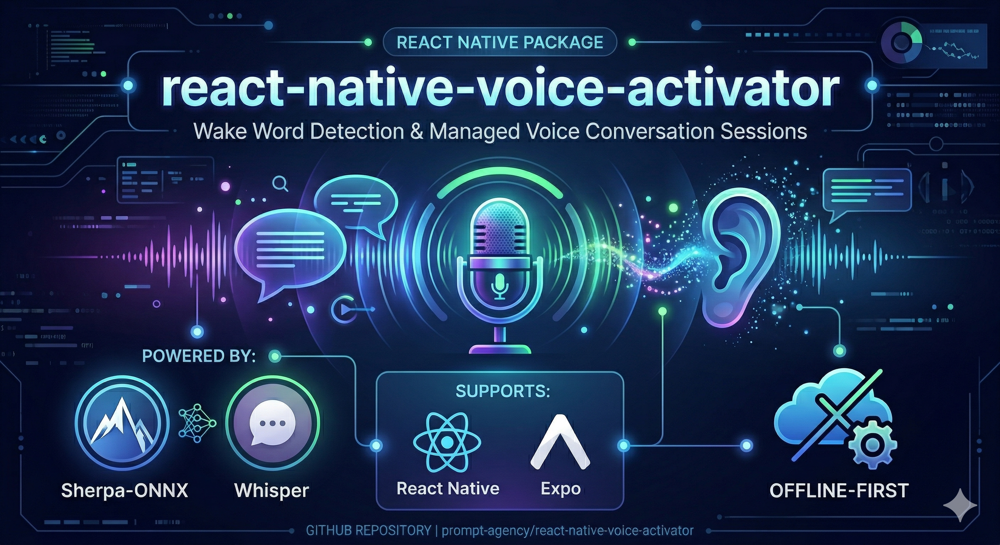
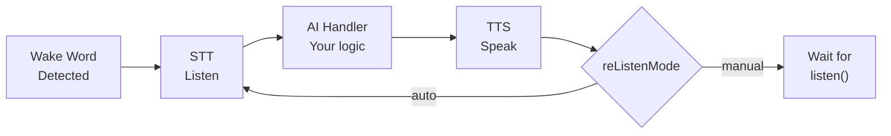

<p align="center">
  
</p>

# react-native-voice-activator

On-device wake word detection and managed multi-turn voice conversation sessions for React Native and Expo. Say a trigger phrase — the package handles listening, transcription, and speech output, you decide what happens with the transcript in between.

No cloud, no API key, no per-use cost. Detection runs entirely on-device; the models are downloaded once (~7.8 MB) on first setup, after which nothing leaves the device. Speech-to-text and text-to-speech also run on-device through opt-in providers.

> **Supports:** React Native `0.83+` · Expo SDK `55+` · iOS · Android
> **Expo Go is NOT supported.** Use `expo prebuild` or EAS Build.

📖 **[Full documentation site](https://prompt-agency.github.io/react-native-voice-activator/)**

## Table of Contents

- [What It Does](#what-it-does)
- [Requirements](#requirements)
- [Installation](#installation)
- [Quickstart](#quickstart)
- [Models Are Downloaded On Demand](#models-are-downloaded-on-demand)
- [Conversation Session](#conversation-session)
- [Wake Words](#wake-words)
- [Optional: Speech-to-Text](#optional-speech-to-text)
- [Optional: Text-to-Speech](#optional-text-to-speech)
- [Troubleshooting](#troubleshooting)
- [Privacy & Compliance](#privacy--compliance)
- [Documentation](#documentation)

---

## What It Does



- **Any wake phrase, no training** — `wakePhrase: 'hey acme'` and you are done. On-device, no cloud, no API key, no per-keyword model. Real engine-backed local detection through the built-in native-managed engine path (Sherpa-ONNX). Models are [downloaded once on demand](#models-are-downloaded-on-demand), then everything runs locally.
- **Managed conversation sessions** — the package drives the full wake → listen → AI → speak → re-listen loop.
- **Barge-in** — say the wake word while the AI is speaking to interrupt TTS and start a new turn. (Interruption latency is not yet measured on physical devices; see [Reliability Validation](docs/reliability-validation.md).)
- **React hooks** — `useWakeWord()` and `useVoiceSession()` for reactive component updates.
- **Expo config plugin** — automatic native configuration (permissions, background modes, manifest entries).
- **Extensible** — inject your own STT and TTS providers. The built-in adapters (`WhisperRNSTTAdapter`, `CustomTTSAdapter`) are opt-in.

## Requirements

| Requirement | Minimum |
|---|---|
| React Native | `0.83+` |
| Expo SDK | `55+` *(Expo users only)* |
| iOS | `13+` |
| Android | API `26+` |

**Expo Go is NOT supported.** Use `expo prebuild` or EAS Build to generate native projects.

## Installation

### Step 1 — Install the package

```sh
npm install react-native-voice-activator
# or
yarn add react-native-voice-activator
```

### Step 2 — Platform setup

**Bare React Native**

Link iOS native libraries via CocoaPods:

```sh
cd ios && pod install
```

No manual Android linking is required for React Native `0.60+`.

**Expo**

Add the config plugin to `app.json` or `app.config.js`:

```json
{
  "expo": {
    "plugins": [
      [
        "react-native-voice-activator",
        {
          "microphonePermissionText": "This app uses the microphone to detect wake words.",
          "speakerModelPath": "./models/campplus.onnx",
          "denoiserModelPath": "./models/gtcrn_simple.onnx"
        }
      ]
    ]
  }
}
```

> `speakerModelPath` and `denoiserModelPath` are optional. When set, the plugin copies the specified model files into the iOS bundle resources and Android assets during `expo prebuild`. Paths are resolved relative to your project root.

Generate your native projects:

```sh
npx expo prebuild
cd ios && pod install
```

The plugin automatically configures:

- iOS microphone usage description
- iOS audio background mode (`UIBackgroundModes: ["audio"]`)
- Android `RECORD_AUDIO` and foreground-service permissions
- Android `WakeWordForegroundService` manifest entry

For detailed setup, see [Bare React Native Setup](docs/bare-react-native-setup.md) or [Expo Setup](docs/expo-setup.md).

## Quickstart

This validates the wake word runtime without STT or TTS. Say **"hey acme"** — or whatever phrase you pass — and the event fires.

```typescript
import {
  prepareModels,
  getModelStatus,
  initialize,
  startDetection,
  stopDetection,
  addWakeWordListener,
  getStatus,
  dispose,
} from 'react-native-voice-activator';

async function runQuickstart() {
  // Always check availability before starting
  const status = getStatus();
  if (status.state === 'unsupported') {
    console.log('Wake word not available:', status.reason);
    return;
  }

  // One-time, ~7.8 MB download. Idempotent, so it is safe to call on every
  // launch — once the models are present it only re-verifies checksums.
  if (!(await getModelStatus()).ready) {
    await prepareModels({
      onProgress: ({ percent }) => console.log(`Models ${percent}%`),
    });
  }

  const onDetected = addWakeWordListener('wakeWordDetected', (event) => {
    console.log('Detected:', event.detectedPhrase);
  });
  const onState = addWakeWordListener('stateChanged', (event) => {
    console.log('State:', event.state);
  });

  try {
    await initialize({ wakePhrase: 'hey acme' }); // any English phrase
    await startDetection();   // start listening
    // Say "Hello World" — wakeWordDetected fires
    await stopDetection();    // stop listening
    await dispose();          // release native resources
  } finally {
    onDetected.remove();
    onState.remove();
  }
}
```

## Models Are Downloaded On Demand

The ONNX models are **not** in the npm package. They are downloaded once, verified against a pinned SHA-256 manifest, and stored in your app's own directory.

That keeps the package at ~220 kB instead of ~42 MB, and keeps ~7.8 MB out of every shipped app binary — including for apps that never turn detection on.

```typescript
import { prepareModels, getModelStatus } from 'react-native-voice-activator';

const status = await getModelStatus();
// { ready: false, missing: [...], directory: '/…/voice-activator/models/1', bytesTotal: 7829... }

if (!status.ready) {
  await prepareModels({
    onProgress: ({ percent, file, fileIndex, fileCount }) => {
      console.log(`${percent}% — ${file} (${fileIndex}/${fileCount})`);
    },
  });
}
```

**`initialize()` does not download for you.** If the models are absent it rejects with a non-recoverable `models_not_prepared` error naming `prepareModels()`. A multi-megabyte transfer should be something your app chooses, schedules and can show progress for — not a side effect of a lifecycle call.

| | |
|---|---|
| Size | ~7.8 MB across 16 files |
| Stored in | iOS `Library/voice-activator/models/<v>`, Android `files/voice-activator/models/<v>` |
| Integrity | every file SHA-256 verified before use; a mismatch is refused, not used |
| Interrupted download | written to a `.part` file and moved into place, so a truncated file is never trusted |
| Repeat calls | idempotent — only missing or corrupt files are re-fetched |

### Self-hosting the models

`prepareModels()` defaults to this package's GitHub release. To serve them yourself and drop the runtime dependency on GitHub:

```typescript
// Mirror of the release assets, flattened names (foo__bar__baz.onnx)
await prepareModels({ baseUrl: 'https://cdn.example.com/voice-models' });

// Or a mirror of the original directory tree
await prepareModels({
  baseUrl: 'https://cdn.example.com/voice-models',
  flatAssets: false,
});
```

### Shipping the models inside your app instead

If you would rather have no runtime download at all, place a model bundle in your app and point at it. `prepareModels()` is then unnecessary:

```typescript
await initialize({
  engineConfig: { assetKeys: { modelAssetKey: 'my-models' } },
});
```

On Android that is a path relative to `android/app/src/main/assets/`, or an absolute filesystem path. On iOS it is a bundle-relative directory or an absolute path.

## Conversation Session

The session API manages the full voice loop: wake word → listen → transcribe → AI → speak → re-listen. Configure once and the package drives the experience.

```typescript
import {
  initialize,
  startDetection,
  useVoiceSession,
  WhisperRNSTTAdapter,
  CustomTTSAdapter,
} from 'react-native-voice-activator';

// Pre-initialize STT — downloads ~75 MB on first run, then cached
const stt = new WhisperRNSTTAdapter({ modelId: 'whisper-tiny-en' });
await stt.initialize();

await initialize({
  sttProvider: stt,
  ttsProvider: new CustomTTSAdapter({
    modelPath: '/path/to/voice.onnx',
    phonemize: async (text) => myPhonemizer.textToIds(text),
  }),
  session: {
    aiHandler: async (transcript) => {
      const response = await myAI.chat(transcript);
      return response.text;
    },
    reListenMode: 'auto',      // re-arm microphone after each turn
    silenceTimeoutMs: 8000,    // end session after 8s of silence
  },
});

await startDetection();
// Say the wake word — the session starts automatically

// React to session state in your component
function VoiceAssistant() {
  const { sessionState, lastTranscript, lastSpeechText, turnCount } = useVoiceSession();

  return (
    <View>
      <Text>State: {sessionState ?? 'waiting for wake word'}</Text>
      <Text>You: {lastTranscript}</Text>
      <Text>AI: {lastSpeechText}</Text>
      <Text>Turn: {turnCount}</Text>
    </View>
  );
}
```

A session requires **both** an STT provider and a TTS provider.

If you supply only one of them, no session starts — but detection does **not** fall back to plain wake-word-only behaviour. It falls through to the single-shot flow, which still calls your STT provider and emits transcription events on every wake word. Supply both, or neither.

See the [Conversation Session guide](docs/conversation-session.md) for barge-in behavior, manual mode, `maxTurns`, VAD configuration, and the full event reference.

## Wake Words

### Use any phrase you like

```typescript
await initialize({ wakePhrase: 'hey acme' });
```

That is the whole setup. No training run, no GPU, no vendor console, no
per-keyword model, no API key.

The bundled keyword spotter is **open-vocabulary**: it detects phrases that were
never in its training data. `bpe.model` ships in the model bundle and
`simple-sentencepiece` is linked into the native library, so the phrase is
tokenized on device. The package writes a small plain-text keywords file beside
the model bundle and reuses it across launches.

Several triggers at once:

```typescript
await initialize({ wakePhrase: ['hey acme', 'ok acme'] });
```

**Choosing a phrase that works:**

| Rule | Why |
|---|---|
| Two or more distinct words | A single short word scores against everything else the model hears and false-fires on ordinary speech |
| At least 6 letters | Same reason; this is the enforced floor |
| A-Z, apostrophes, spaces only | Digits and punctuation cannot be tokenized as spoken — write "hey acme two", not "hey acme 2" |
| Phonetically distinctive | Avoid phrases that rhyme with common speech in your app's context |
| Under 40 characters | Users will not say a long phrase consistently |

Invalid phrases are rejected by `initialize()` with a non-recoverable
`wake_phrase_invalid` error listing every problem, rather than silently producing
a keyword that never matches.

> **Detection accuracy for arbitrary phrases is not yet measured on physical
> devices.** Sherpa-ONNX publishes no false-accept rates for its open-vocabulary
> path, and neither do we yet. Tune with `engineConfig.sensitivity` and measure
> in your own acoustic conditions before shipping. See
> [Reliability Validation](docs/reliability-validation.md).

### Pre-tokenized presets

The model bundle also carries nine pre-tokenized keyword files from the upstream
Sherpa-ONNX demo set. They exist for quick smoke-testing — `keywords-hello-world.txt`
is handy because "Hello World" is unambiguous — and are **not** recommended for
shipping: several are trademarked phrases, and none of them is your product's name.

Select one with `engineConfig.assetKeys.keywordAssetKey` instead of `wakePhrase`
(the two are mutually exclusive):

| Wake Word | `keywordAssetKey` |
|---|---|
| Hello World *(recommended for testing)* | `keywords-hello-world.txt` |
| Hi Google | `keywords-hi-google.txt` |
| Hey Siri | `keywords-hey-siri.txt` |
| Alexa | `keywords-alexa.txt` |
| Love and Peace | `keywords-love-and-peace.txt` |
| Play Music | `keywords-play-music.txt` |
| Go Home | `keywords-go-home.txt` |
| Happy New Year | `keywords-happy-new-year.txt` |
| Merry Christmas | `keywords-merry-christmas.txt` |

Select a keyword by passing `engineConfig.assetKeys.keywordAssetKey` to `initialize()`:

```typescript
await initialize({
  engineConfig: {
    assetKeys: { keywordAssetKey: 'keywords-hello-world.txt' },
  },
});
```

To train a custom wake word, see the [Wake Word Training guide](docs/model-training/wake-word-training.md).

## Optional: Speech-to-Text

`WhisperRNSTTAdapter` provides fully on-device transcription via [whisper.rn](https://github.com/mybigday/whisper.rn). The tiny English model downloads once (~75 MB) and runs locally — no cloud API needed.

**Install peer dependencies:**

```sh
# All platforms
yarn add whisper.rn react-native-fs

# iOS only
yarn add react-native-audio-recorder-player

# Android only
yarn add @fugood/react-native-audio-pcm-stream
```

> [!WARNING]
> **Android STT is currently blocked on supported versions.** `@fugood/react-native-audio-pcm-stream` (last released 2025-10) needs the Old Architecture `RCTEventEmitter` bridge. React Native 0.82 removed the ability to fall back to the Legacy Architecture, and Expo SDK 55 removed the `newArchEnabled` option entirely — so the usual workaround cannot be applied on this package's minimum supported versions (RN 0.83+ / Expo SDK 55+).
>
> `WhisperRNSTTAdapter` therefore works on iOS but not on Android right now. Tracking issue: replace the Android capture path with the package's own native `startVADCapture`, which removes this peer dependency entirely.

After installing, re-run `cd ios && pod install`.

See the [WhisperRN provider guide](docs/examples/whisper-stt-provider.md) for initialization, usage, and troubleshooting.

## Optional: Text-to-Speech

Two TTS adapters are available depending on your needs:

### `SherpaOnnxTTSAdapter` (recommended — iOS and Android)

Runs Piper VITS models entirely on-device via the sherpa-onnx native layer. No additional peer dependencies — the native layer is already bundled.

**No extra install required.** The adapter is exported from the main package.

**Android:** Model assets must be placed in `android/app/src/main/assets/sherpa-tts/` before building. See the [Android TTS Setup guide](docs/android-tts-setup.md) for download commands and runtime asset-copy setup.

**iOS:** Add the `en_US-ryan-low.onnx`, `tokens.txt`, and `espeak-ng-data/` to Xcode → Copy Bundle Resources, or let the Expo config plugin copy them automatically.

```ts
import { SherpaOnnxTTSAdapter } from 'react-native-voice-activator';

const tts = new SherpaOnnxTTSAdapter({
  modelPath:  `${RNFS.DocumentDirectoryPath}/sherpa-tts/en_US-ryan-low.onnx`,
  tokensPath: `${RNFS.DocumentDirectoryPath}/sherpa-tts/tokens.txt`,
  dataDir:    `${RNFS.DocumentDirectoryPath}/sherpa-tts/espeak-ng-data`,
});
```

### `CustomTTSAdapter` (iOS and Android)

Runs any Piper TTS ONNX model on-device via `onnxruntime-react-native`. You provide the ONNX model file and a phonemize callback.

**Install peer dependency:**

```sh
npm install onnxruntime-react-native
```

**iOS ONNX conflict:** Adding `onnxruntime-react-native` may cause duplicate ONNX symbol linker errors on iOS, since this package also bundles an ONNX Runtime for Sherpa. See the [iOS ONNX Conflict Resolution guide](docs/ios-onnx-conflict-resolution.md).

See the [Custom TTS guide](docs/examples/custom-tts-provider.md) for model sourcing, the phonemize callback, and adapter wiring.

## Troubleshooting

### `getStatus().state === 'unsupported'` on startup

The runtime cannot start — `getStatus().lastError` explains why. For `permission` errors, on iOS confirm `NSMicrophoneUsageDescription` is in `Info.plist` and the prompt was accepted; on Android, call `PermissionsAndroid.request(RECORD_AUDIO)` before `startDetection()`.

### No `wakeWordDetected` event after speaking

- Confirm microphone permission is granted (check `getStatus().lastError.category === 'permission'`).
- Test on a physical device — iOS Simulator audio input is unreliable for wake word detection.
- Try "Hello World" as a baseline; it is the most reliably detected built-in phrase.

### `platform` error on Android

Android background continuation requires a visible app context for start, microphone permission, and an active foreground-service notification. Move your `startDetection()` call to your main screen's mount or a button press handler. OEM battery management may constrain background behavior beyond what this package controls.

### `platform` error on iOS after backgrounding

supported iOS background continuation requires `UIBackgroundModes` to include `audio`. Without it the runtime transitions to `unsupported` when the app backgrounds. Force-quit and cold relaunch are not supported for background detection.

### Wake word detected but no session starts

A conversation session requires **both** `sttProvider` and `ttsProvider` to be passed to `initialize()`. If either is missing, the session loop does not activate.

### iOS build error: duplicate ONNX symbols

You are linking two ONNX Runtime copies. See the [iOS ONNX Conflict Resolution guide](docs/ios-onnx-conflict-resolution.md).

For the complete error category reference and background detection constraints, see [docs/troubleshooting.md](docs/troubleshooting.md) and the [Background Behavior guide](docs/background-behavior.md).

## Wake-to-Transcribe-to-Speak Flow

STT and TTS providers are **opt-in but package-driven**. You supply the provider; the package calls it.

If you pass no `sttProvider`, the package emits `wakeWordDetected` and stops there — your app handles everything after that.

If you pass an `sttProvider` to `initialize()`, the package takes over the flow and drives it for you:

1. Wake word fires → package emits `wakeWordDetected`
2. Package calls `sttProvider.transcribe()` and emits `transcriptionStarted`, then `transcriptionResult`
3. Your AI handler processes the transcript
4. If `autoSpeak: true`, the package calls `ttsProvider.speak()` and emits `speechStarted`, then `speechCompleted`

The provider *implementations* are yours (or one of the bundled adapters); the orchestration between them is the package's. See [docs/examples/](docs/examples/) for provider implementations you can copy.

### Provider timeouts

Orchestration runs on one shared serial queue, so a provider call that never settles would block every subsequent wake word. Each `transcribe()` and `speak()` call is therefore bounded by `providerTimeoutMs` (default `30000`):

```typescript
await initialize({
  sttProvider,
  ttsProvider,
  providerTimeoutMs: 30_000, // 0 disables the bound
});
```

On expiry the package emits `transcriptionError` with code `stt_timeout` (or `speechError` with `tts_timeout`), asks the provider to `cancel()`/`stop()`, and frees the queue for the next wake word.

A managed session takes its own bounds, because `silenceTimeoutMs` only guards a user who never speaks, not a provider that never returns:

```typescript
session: {
  aiHandler,
  reListenMode: 'auto',
  providerTimeoutMs: 30_000,  // transcribe() and speak()
  aiHandlerTimeoutMs: 60_000, // your AI handler
}
```

The defaults are deliberately generous: on-device transcription of a long utterance on an older phone takes seconds, and cutting off a slow-but-working provider is worse than waiting. These bound a wedged call, they do not enforce latency. See [Conversation Session](docs/conversation-session.md#timeouts-what-silencetimeoutms-does-not-cover) for the full table.

## Privacy & Compliance

This library provides on-device speaker verification using biometric voiceprint data. **Consuming apps have legal obligations** under multiple privacy frameworks.

### What the Library Does

- All speaker embedding extraction and comparison runs **on-device** — no data is sent to external servers
- The library **never stores, caches, or logs** speaker embeddings or raw audio internally
- Enrollment data exists only in memory and is accessible via `exportEnrollment()`
- Calling `clearEnrollment()` removes all biometric data from memory immediately

### What Your App Must Do

#### GDPR (EU — Article 9: Special Category Data)

Voiceprint embeddings are **biometric data** under GDPR Art. 9. Your app must:
- Obtain **explicit consent** before calling `enrollSpeaker()`
- Provide a clear privacy notice explaining voiceprint processing
- Implement data subject rights (access, deletion, portability)
- Document your lawful basis for processing biometric data

#### CCPA (California — Biometric Information)

Voiceprint data is classified as **biometric information** under CCPA. Your app must:
- Disclose collection of biometric information in your privacy policy
- Honor opt-out and deletion requests
- Not sell biometric information

#### BIPA (Illinois — Biometric Information Privacy Act)

BIPA requires **written consent before collection**. Your app must:
- Obtain informed written consent before the first `enrollSpeaker()` call
- Publish a retention schedule and destruction policy
- Not profit from biometric data

### Compliant Integration Example

```typescript
import { voiceActivator } from 'react-native-voice-activator';

async function enrollWithConsent(userId: string, audioBuffer: ArrayBuffer) {
  // 1. Obtain explicit consent BEFORE enrollment (app-owned UI)
  const hasConsent = await showBiometricConsentDialog(userId);
  if (!hasConsent) {
    throw new Error('User must provide explicit consent before enrollment');
  }

  // 2. Enroll speaker (library processes audio, returns embedding)
  await voiceActivator.enrollSpeaker(userId, audioBuffer);

  // 3. Export and store securely (app-owned storage)
  const enrollment = await voiceActivator.exportEnrollment();
  await secureStorage.save(`enrollment_${userId}`, JSON.stringify(enrollment));
}

async function handleAccountDeletion(userId: string) {
  // On account deletion or consent revocation:
  await voiceActivator.clearEnrollment();
  await secureStorage.delete(`enrollment_${userId}`);
}
```

### Your Responsibilities Summary

| Responsibility | Required By | Action |
|----------------|-------------|--------|
| Explicit consent before enrollment | GDPR, BIPA, CCPA | Show consent UI before `enrollSpeaker()` |
| Retention/deletion policy | BIPA, GDPR | Document how long you store enrollment data |
| Secure storage of exported data | All | Encrypt `exportEnrollment()` output at rest |
| Deletion on revocation | GDPR, BIPA | Call `clearEnrollment()` + delete stored data |
| Privacy policy disclosure | All | State you collect biometric voiceprint data |

## Built-In Model Configuration

The Sherpa-ONNX model defaults are resolved internally, from the on-demand bundle unless you override the root. The supported public override points remain `engineConfig.assetKeys.modelAssetKey` (the main acoustic model) and `engineConfig.assetKeys.keywordAssetKey` (the keyword detection file). See [Wake Words](#wake-words) for `wakePhrase` and the preset list.

## Example App and Reliability

The example app (`example/`) is the primary integration reference. The example app also exposes evaluator-facing runtime diagnostics:

- current normalized runtime status from `getStatus()`
- recent runtime events including `stateChanged`, `error`, `interruption`, and `audioRouteChanged`
- normalized error-category surface: `permission`, `lifecycle`, `configuration`, `engine`, `platform`, and `internal`

Reliability evaluation artifacts are in `tests/fixtures/reliability/latest-results.json`. These record detection quality from automated host-side validation runs.

Expo config and prebuild compatibility are validated through docs, contract checks, the Expo-capable example package scripts in `example/package.json`, an Expo CLI config resolution check against the example app, and Expo prebuild generation against a temporary copy of the example app.

## Documentation

| Document | Description |
|---|---|
| [LLM/AI Assistant Context](docs/llm-context.md) | One-stop orientation for AI assistants and developers |
| [Getting Started](docs/getting-started.md) | Step-by-step setup walkthrough from zero to first detection |
| [Bare React Native Setup](docs/bare-react-native-setup.md) | Native project configuration for bare React Native |
| [Expo Setup](docs/expo-setup.md) | Config plugin and prebuild setup for Expo |
| [Conversation Session](docs/conversation-session.md) | Full session API, events, barge-in, and React hooks |
| [Background Behavior](docs/background-behavior.md) | iOS and Android background detection constraints |
| [WhisperRN STT Provider](docs/examples/whisper-stt-provider.md) | On-device speech-to-text setup |
| [Custom TTS Provider](docs/examples/custom-tts-provider.md) | On-device text-to-speech setup |
| [iOS ONNX Conflict Resolution](docs/ios-onnx-conflict-resolution.md) | Fix duplicate ONNX symbol errors |
| [Wake Word Training](docs/model-training/wake-word-training.md) | Train a custom wake word offline |
| [TTS Voice Cloning](docs/model-training/tts-voice-cloning.md) | Train a custom TTS voice |
| [Troubleshooting](docs/troubleshooting.md) | Full error category reference |
| [Professional Services](docs/professional-services.md) | Get help with custom model training and integration |

## Contributing

- [Development workflow](CONTRIBUTING.md#development-workflow)
- [Sending a pull request](CONTRIBUTING.md#sending-a-pull-request)
- [Code of conduct](CODE_OF_CONDUCT.md)

## License

MIT.

This package redistributes third-party native binaries and model weights
(sherpa-onnx and its GigaSpeech keyword-spotting model under Apache-2.0, ONNX
Runtime and Silero VAD under MIT). Apps that ship this package redistribute
them too. See [THIRD-PARTY-NOTICES.md](./THIRD-PARTY-NOTICES.md) for the
required attribution and full license texts.

---

<a href="https://prompt-digital.agency/" target="_blank">Prompt Digital Agency</a> &middot; <a href="mailto:hello@prompt-digital.agency">hello@prompt-digital.agency</a>
