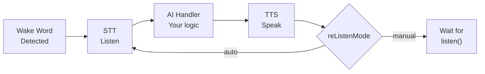

## What It Does



## Quick Install

```sh
npm install react-native-voice-activator
```

Continue with [Getting Started](/getting-started) for platform setup (bare React Native or Expo), then [Conversation Session](/conversation-session) for the full session API. Upgrading from an earlier release? See [Upgrading](/upgrading).

> **Supports:** React Native `0.86+` &middot; Expo SDK `57+` &middot; iOS &middot; Android
> **Expo Go is NOT supported.** Use `expo prebuild` or EAS Build.

---

Built by [Prompt Digital Agency](https://prompt-digital.agency/) &middot; [hello@prompt-digital.agency](mailto:hello@prompt-digital.agency)
